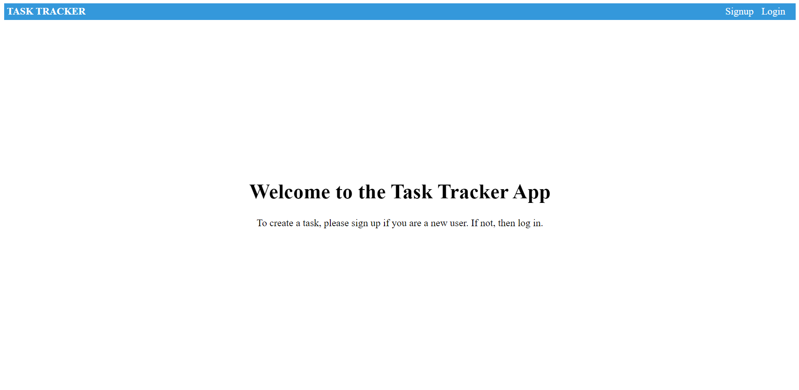
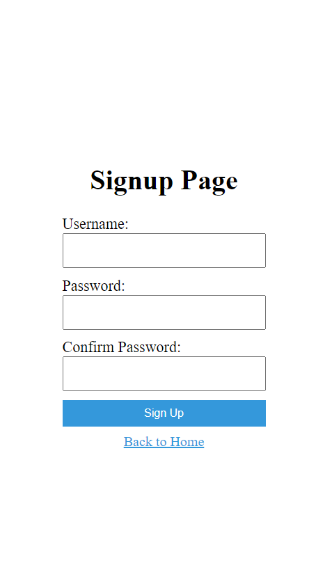
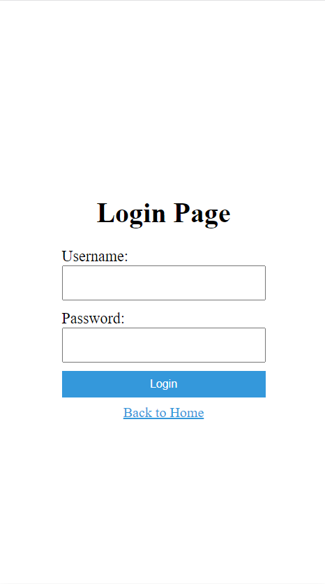
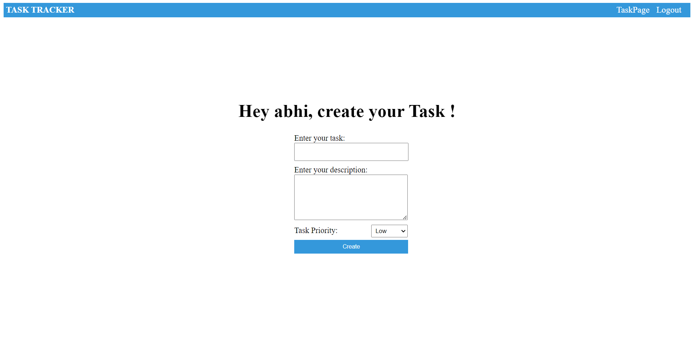
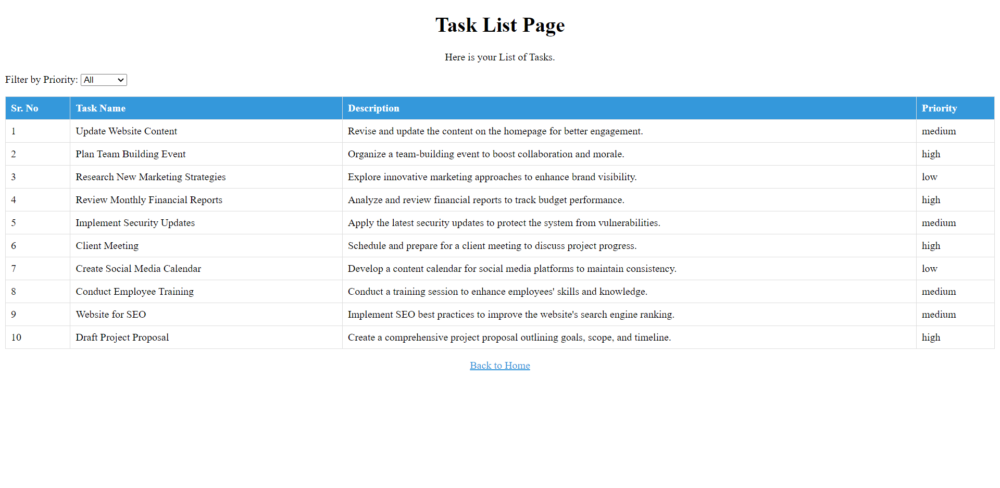

# Task Tracker App

Task Tracker App is a web application that allows users to manage and track their tasks efficiently.

## Frontend Design

1. Home Page

   

2. Sign Up Page

   

3. Login page

   

4. After Login

   

5. Task ListPage

   

## Features

- **User Authentication:** Sign up and log in securely to manage your tasks.
- **Task Creation:** Create tasks with a name, description, and priority.
- **Task Listing:** View a list of your tasks, organized by priority.
- **Task Details:** Click on a task to view its details, including description and priority.

## Technologies Used

- Frontend: Vue.js, JavaScript, HTML, CSS
- Backend: Nest.js, MongoDB, TypeScript
- Authentication: JWT (JSON Web Tokens)

## Getting Started

### Prerequisites

- Node.js and npm installed
- MongoDB installed and running

### Installation

1. Clone the repository:

   ```bash
   git clone https://github.com/abhi07070/Task-Tracker-App.git
   cd Task-Tracker-App
   ```

2. Install dependencies for both the frontend and backend:

```
client-side
npm install

server-side
npm install
```

3. Configure environment variables:
   Create a .env file in the server directory and add your MongoDB connection URI, JWT secret, and other necessary variables.

4. Start the backend server:

```
cd server
npm start

```

5. tart the frontend application:

```
cd client
npm run serve

```
